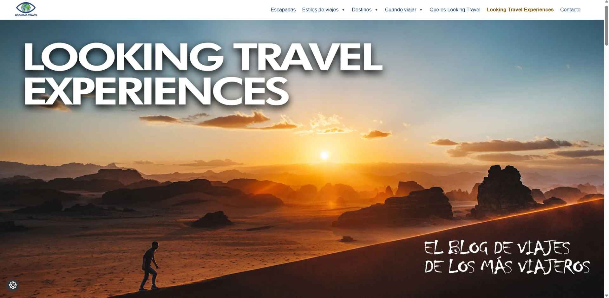
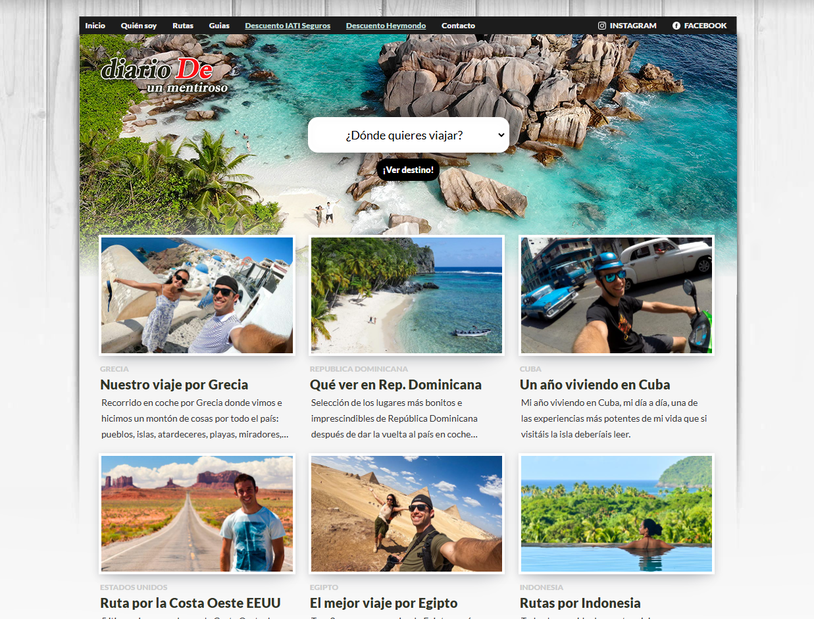
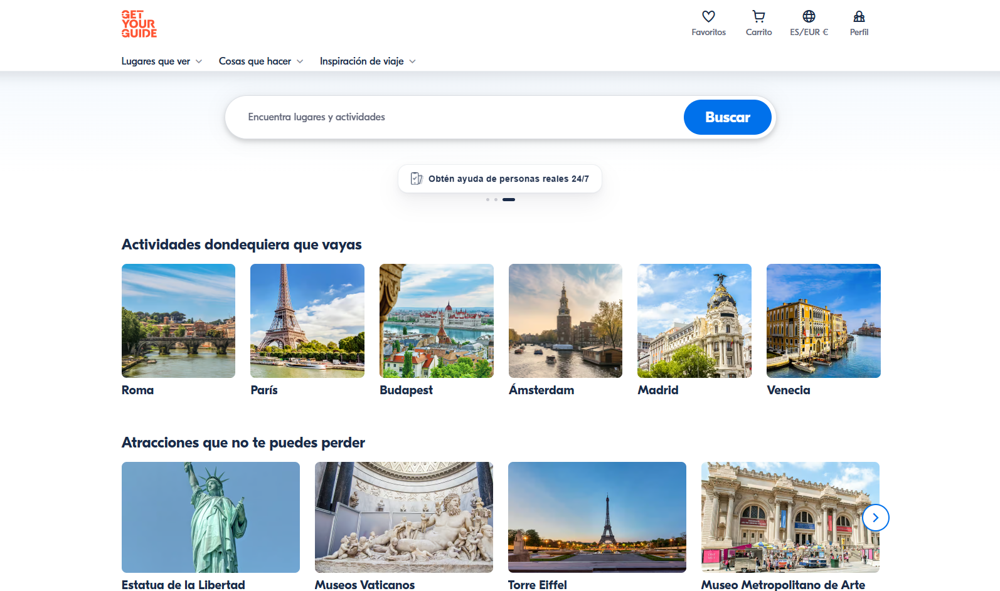

This is a [Next.js](https://nextjs.org) project bootstrapped with [`create-next-app`](https://nextjs.org/docs/app/api-reference/cli/create-next-app).

## Getting Started

First, run the development server:

```bash
npm run dev
# or
yarn dev
# or
pnpm dev
# or
bun dev
```

Open [http://localhost:3000](http://localhost:3000) with your browser to see the result.

You can start editing the page by modifying `app/page.tsx`. The page auto-updates as you edit the file.

This project uses [`next/font`](https://nextjs.org/docs/app/building-your-application/optimizing/fonts) to automatically optimize and load [Geist](https://vercel.com/font), a new font family for Vercel.

## Learn More

To learn more about Next.js, take a look at the following resources:

- [Next.js Documentation](https://nextjs.org/docs) - learn about Next.js features and API.
- [Learn Next.js](https://nextjs.org/learn) - an interactive Next.js tutorial.

You can check out [the Next.js GitHub repository](https://github.com/vercel/next.js) - your feedback and contributions are welcome!

## Deploy on Vercel

The easiest way to deploy your Next.js app is to use the [Vercel Platform](https://vercel.com/new?utm_medium=default-template&filter=next.js&utm_source=create-next-app&utm_campaign=create-next-app-readme) from the creators of Next.js.

Check out our [Next.js deployment documentation](https://nextjs.org/docs/app/building-your-application/deploying) for more details.

## 🎨 Referencias de Diseño

Antes de comenzar el desarrollo de la aplicación, analizamos diferentes plataformas relacionadas con viajes y descubrimiento de experiencias para identificar patrones de diseño, distribución del contenido y elementos de interfaz que nos sirvan como inspiración.

Nuestro objetivo es desarrollar una aplicación moderna, intuitiva y visualmente atractiva, donde los usuarios puedan descubrir experiencias, realizar búsquedas y aplicar filtros de manera sencilla.

---

### 1. Looking Travel

**Sitio web:**  
https://lookingtravel.com/experiencias-de-viajes/



#### ¿Por qué la elegimos?

Esta plataforma presenta una distribución clara de las experiencias mediante tarjetas visuales, facilitando la exploración del contenido.

#### Elementos que nos inspiran

- Diseño basado en tarjetas (cards).
- Fotografías de gran tamaño.
- Distribución ordenada del contenido.
- Buena jerarquía visual.
- Diseño responsive.

---

### 2. Diario de un Mentiroso

**Sitio web:**  
https://www.diariodeunmentiroso.com/



#### ¿Por qué la elegimos?

Destaca por su estilo editorial y el protagonismo que da a las imágenes, ofreciendo una experiencia muy agradable para descubrir nuevos destinos.

#### Elementos que nos inspiran

- Diseño limpio y elegante.
- Grandes imágenes de portada.
- Excelente uso de los espacios en blanco.
- Tipografía agradable y legible.
- Presentación visual del contenido.

---

### 3. GetYourGuide

**Sitio web:**  
https://www.getyourguide.com/



#### ¿Por qué la elegimos?

GetYourGuide es una de las plataformas líderes en el sector travel-tech y representa muy bien el tipo de experiencia que queremos ofrecer en nuestro proyecto. Su interfaz facilita la búsqueda y el descubrimiento de actividades mediante filtros intuitivos y una navegación muy clara.

#### Elementos que nos inspiran

- Barra de búsqueda destacada.
- Sistema de filtros por categorías y destinos.
- Tarjetas modernas con imágenes llamativas.
- Información organizada y fácil de escanear.
- Navegación intuitiva.
- Excelente experiencia de usuario (UX).

---

## Decisiones de diseño

Tras analizar estas referencias, nuestro proyecto incorporará los siguientes elementos:

- Interfaz limpia, moderna y fácil de navegar.
- Barra de búsqueda visible desde la página principal.
- Sistema de filtros por categorías y destinos.
- Tarjetas visuales para mostrar las experiencias.
- Fotografías de alta calidad como elemento protagonista.
- Diseño responsive adaptado a dispositivos móviles y escritorio.
- Espacios amplios que favorezcan la legibilidad y la experiencia de usuario.
- Navegación rápida e intuitiva para facilitar el descubrimiento de nuevas experiencias.